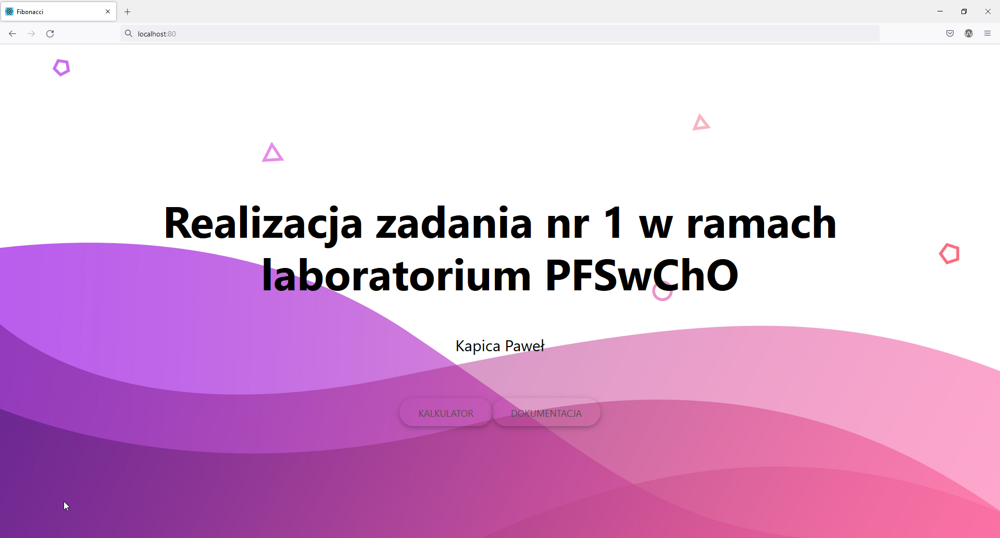
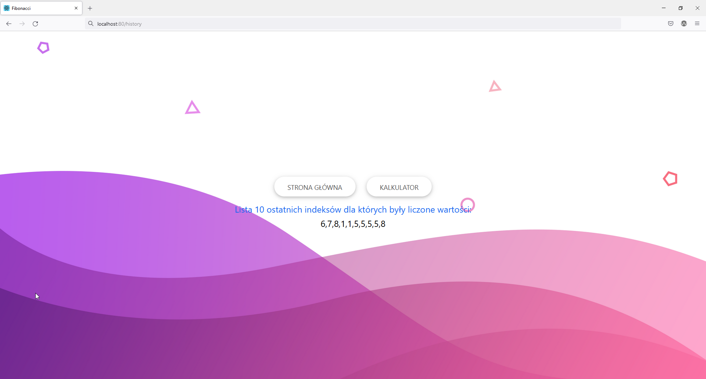
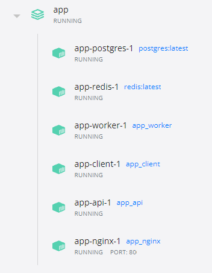
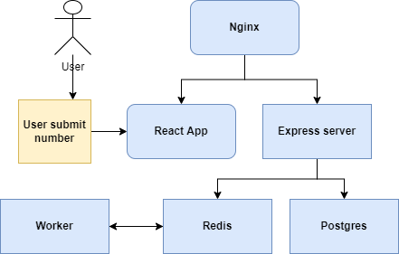

## Aplikacja - strona główna

## Aplikacja - historia wpisanych współczynników

## Uruchomienie usługi
W katalogu głównym repozytorium można uruchomić usługę poleceniem:
`docker compose up`

Aplikacja jest dostępna pod adresem `http://localhost:80`

## Dokumentacja

Został dodany serwis oparty na obrazie postgres, którego zadaniem jest przechowywanie wprowadzonych współczynników dla których zostały wyliczone wartości ciągu Fibonacciego

Został dodany serwis redis, jego rola sprowadza się do przechowywania informacji o wyliczonych wartościach ciągu Fibonacciego wraz z odpowiadającymi im współczynnikami

Został dodany serwis nginx, pełni on funkcję proxy. To z nim wchodzi w interakcję użytkownik gdy łączy się ze stroną. Wiąże aplikację react z backendem stworzonym w node

Został dodany serwis worker, który w przypadku wprowadzenia nowego zdarzenia w bazie redis - dodanie współczynnika, zapisuje do bazy redis odpowiednią wartość ciągu Fibonacciego

W przypadku aplikcji frontendowej dodano:
* strone główną,
* stronę dokumentacji
* historię wprowadzonych współczynników.

Dla strony na której możemy obliczyć wartość ciągu dla podanego współczynnika dodano wyświetlanie informacji o obliczonych wartościach - komunikacja z bazą redis.

W celu poprawnego przemiszczania się między stronami został stworzony routing w App.js.

Została zmieniona funkcja obliczająca wartości ciągu dla poszczególnych współczynników w workerze. Wpisane zostały statyczne wartości. Pozwoliło to osiągnąc bardzo szybkie obliczanie wartości. Ograniczona została również maksymalna wartość podawanego współczynnika do 20

